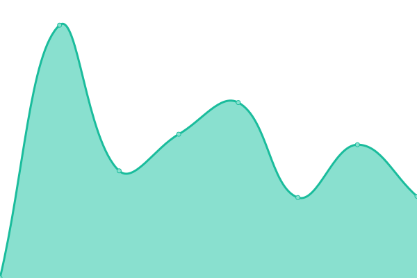

# [📈 Live Status](https://MarseyLivesMatter.github.io/uptime): <!--live status--> **🟧 Partial outage**

This repository contains the open-source uptime monitor and status page for [MarseyLivesMatter](https://rdrama.net/@chiobu), powered by [Upptime](https://github.com/upptime/upptime).

With [Upptime](https://upptime.js.org), you can get your own unlimited and free uptime monitor and status page, powered entirely by a GitHub repository. We use [Issues](https://github.com/MarseyLivesMatter/uptime/issues) as incident reports, [Actions](https://github.com/MarseyLivesMatter/uptime/actions) as uptime monitors, and [Pages](https://MarseyLivesMatter.github.io/uptime) for the status page.

<!--start: status pages-->
<!-- This summary is generated by Upptime (https://github.com/upptime/upptime) -->
<!-- Do not edit this manually, your changes will be overwritten -->
<!-- prettier-ignore -->
| URL | Status | History | Response Time | Uptime |
| --- | ------ | ------- | ------------- | ------ |
|  [marsey.cloud](https://nginx.marsey.cloud) | 🟥 Down | [marsey-cloud.yml](https://github.com/MarseyLivesMatter/uptime/commits/HEAD/history/marsey-cloud.yml) | 

 0ms
     
 | 

<a href="https://MarseyLivesMatter.github.io/uptime/history/marsey-cloud">0.00%</a>
    

|  [lmao.works](https://nginx.lmao.works) | 🟩 Up | [lmao-works.yml](https://github.com/MarseyLivesMatter/uptime/commits/HEAD/history/lmao-works.yml) | 

 602ms
     
 | 

<a href="https://MarseyLivesMatter.github.io/uptime/history/lmao-works">100.00%</a>
    

|  [lynwood.fun](https://nginx.lynwood.fun) | 🟩 Up | [lynwood-fun.yml](https://github.com/MarseyLivesMatter/uptime/commits/HEAD/history/lynwood-fun.yml) | 

 1086ms
     
 | 

<a href="https://MarseyLivesMatter.github.io/uptime/history/lynwood-fun">99.85%</a>
    

|  [lmfao.quest](https://nginx.lmfao.quest) | 🟥 Down | [lmfao-quest.yml](https://github.com/MarseyLivesMatter/uptime/commits/HEAD/history/lmfao-quest.yml) | 

 0ms
     
 | 

<a href="https://MarseyLivesMatter.github.io/uptime/history/lmfao-quest">0.00%</a>
    

<!--end: status pages-->

[**Visit our status website →**](https://MarseyLivesMatter.github.io/uptime)

## 📄 License

- Powered by: [Upptime](https://github.com/upptime/upptime)
- Code: [MIT](./LICENSE) © [MarseyLivesMatter](https://rdrama.net/@chiobu)
- Data in the `./history` directory: [Open Database License](https://opendatacommons.org/licenses/odbl/1-0/)
